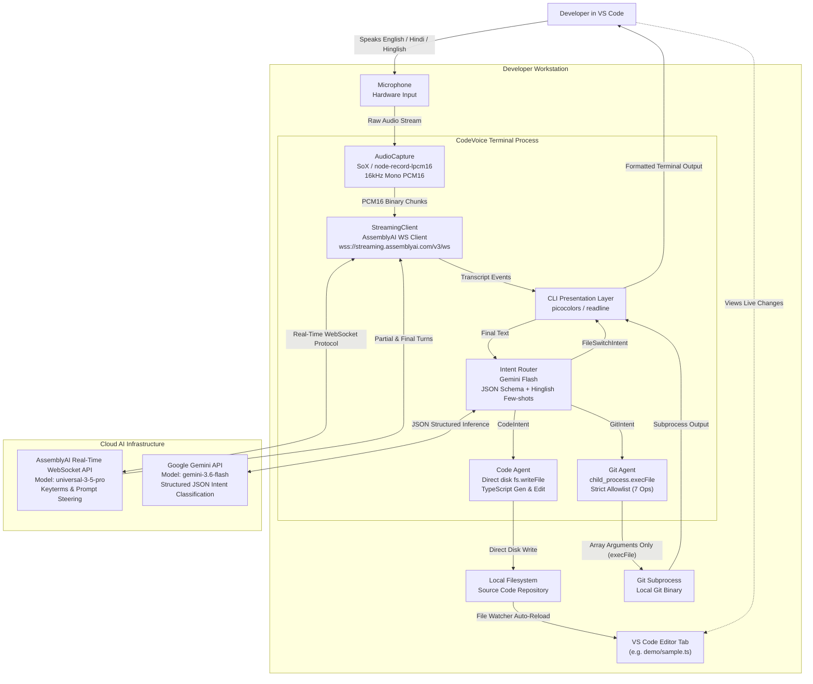
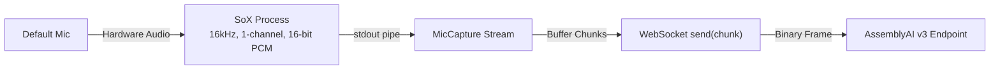
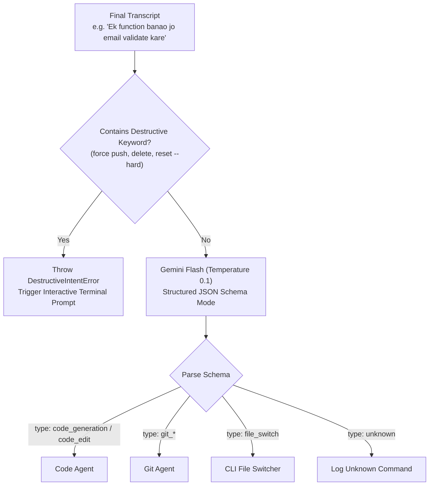
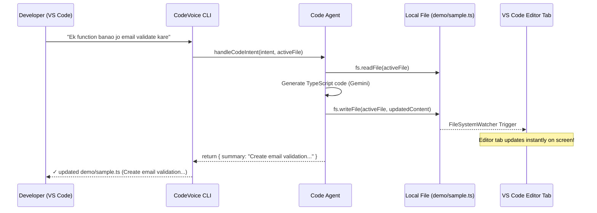
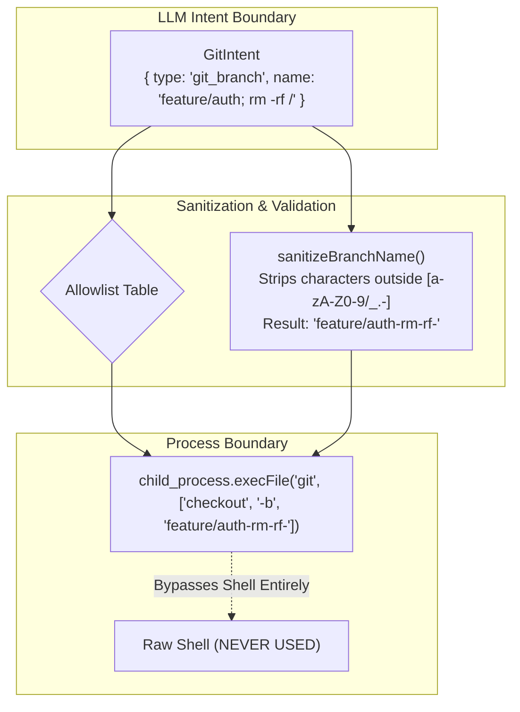
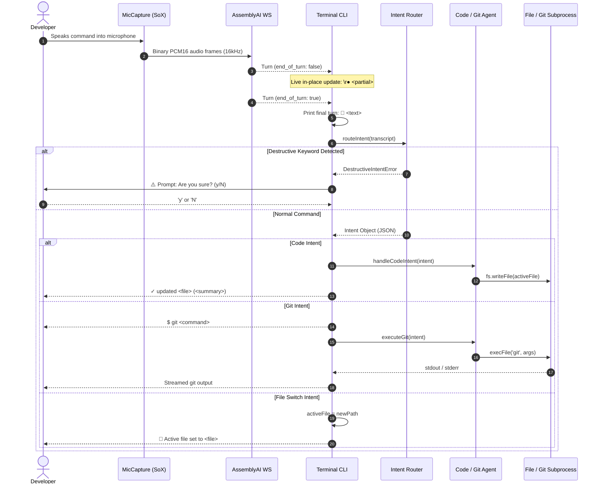

# CodeVoice architecture

CodeVoice is a multilingual voice interface for software development running directly inside the VS Code integrated terminal. The application combines continuous low-latency microphone capture, real-time WebSocket streaming with AssemblyAI's `universal-3-5-pro` model, domain vocabulary steering via `keyterms_prompt`, multilingual intent routing powered by Gemini Flash, direct filesystem code generation and editing, and an allowlisted, sanitized Git execution engine.

---

## System context



---

## Component responsibilities

| Component | Responsibility |
|---|---|
| **AudioCapture (`src/voice/capture.ts`)** | Streams 16kHz mono PCM16 audio from the default input device via a SoX child process. Buffers and emits binary audio chunks to the streaming client. |
| **StreamingClient (`src/voice/streaming.ts`)** | Manages WebSocket connection to `wss://streaming.assemblyai.com/v3/ws`. Sends raw API key authorization, applies URL parameters (`speech_model`, `mode`, `prompt`, `keyterms_prompt`), handles message turns, and sends `{"type":"Terminate"}` upon shutdown. |
| **Keyterms Vocabulary (`demo/keyterms.ts`)** | Curated catalog of 50+ programming terms, React hooks, authentication tokens, and Hinglish verb phrases passed to AssemblyAI on session start to boost recognition of technical identifiers. |
| **Intent Router (`src/intent/router.ts`)** | Classifies final speech transcripts into a strongly typed TypeScript discriminated union (`CodeIntent \| GitIntent \| FileSwitchIntent`) using Gemini Flash with JSON Schema enforcement and Hinglish few-shot examples. Enforces pre-LLM destructive keyword checks. |
| **Code Agent (`src/agents/codeAgent.ts`)** | Reads the active target file, constructs a structured code generation/editing prompt with TypeScript guidelines, queries Gemini Flash, and writes the output directly back to disk. Returns a one-line summary for terminal reporting. |
| **Git Agent (`src/agents/gitAgent.ts`)** | Translates structured `GitIntent` objects into an explicit command allowlist. Executes commands using `child_process.execFile` with argument arrays (never arbitrary shell strings) and applies parameter sanitization. |
| **CLI Presentation (`src/cli.ts`)** | Orchestrates the session lifecycle, renders real-time in-place partial transcripts (`\r● ...`), prints formatted turns with language badges, echoes Git commands, and handles interactive readline confirmation prompts for destructive commands. |
| **Configuration (`src/utils/config.ts`)** | Validates required environment variables, loads default paths, and configures global network settings (`dns.setDefaultResultOrder('ipv4first')`) to eliminate Node.js 24 IPv6 connection timeouts. |

---

## Audio ingestion & streaming pipeline



1. **Low-Latency Hardware Streaming**:
   `node-record-lpcm16` spawns `sox` as a background process configured for:
   - Sample Rate: `16,000 Hz`
   - Channels: `1` (Mono)
   - Encoding: `Signed 16-bit Little-Endian PCM`
2. **Backpressure & Clean Teardown**:
   When the session terminates (via `Ctrl+C`), `MicCapture.stop()` terminates the SoX subprocess immediately to prevent orphaned audio recording locks.

---

## AssemblyAI real-time speech engine

CodeVoice connects to the AssemblyAI streaming WebSocket v3 endpoint:
```text
wss://streaming.assemblyai.com/v3/ws?sample_rate=16000&speech_model=universal-3-5-pro&mode=balanced&prompt=...&keyterms_prompt=[...]
```

### Protocol implementation details

1. **Authentication**:
   Raw API key passed in the `Authorization` HTTP header on WebSocket upgrade (without `Bearer` prefix).
2. **Model Selection**:
   Singular `speech_model=universal-3-5-pro` (real-time streaming uses singular string, distinct from async API arrays).
3. **Contextual Steering (`prompt`)**:
   URL query parameter providing domain-level guidance:
   `"Software development voice commands in English and Hindi for code generation and Git actions."`
4. **Keyterm Boosting (`keyterms_prompt`)**:
   JSON-stringified array of up to 100 terms (`JSON.stringify(["useEffect", "useState", "JWT", "API", ...])`). Injects vocabulary hints that bias acoustic-to-text token probability for technical acronyms and Hinglish developer phrases.
5. **Session Message Lifecycle**:
   - **`Begin`**: Handshake confirmed; server yields `session_id`. Mic streaming commences.
   - **`SpeechStarted`**: Ambient voice trigger.
   - **`Turn`**: Streaming updates. `end_of_turn: false` delivers live partials; `end_of_turn: true` delivers the finalized, formatted transcript with filler words stripped.
   - **`Terminate`**: CodeVoice sends `{"type":"Terminate"}` on exit, ensuring sessions close cleanly and do not accrue idle billing charges.

---

## Intent routing & multilingual understanding



1. **Zero-Latency Safety Gate**:
   Transcripts are evaluated against `DESTRUCTIVE_KEYWORDS` *before* invoking the LLM. If a destructive pattern is matched, a `DestructiveIntentError` is thrown immediately, bypassing external API latency and guarding against prompt manipulation.
2. **Hinglish Few-Shot Conditioning**:
   The system prompt equips the model with canonical English, Hindi, and code-switched Hinglish patterns:
   - `"Ek email validator function banao"` ➔ `code_generation`
   - `"useEffect ke andar API call add karo"` ➔ `code_edit`
   - `"Nayi branch banao feature-login"` ➔ `git_branch`
   - `"Sab files add karo"` ➔ `git_add`
   - `"Commit karo add validation"` ➔ `git_commit`
3. **Resilient Rate-Limit Backoff**:
   API calls automatically catch HTTP 429 quota exhaustion and apply exponential retry backoff, preserving session continuity during rapid voice inputs.

---

## Code agent & filesystem integration

Unlike conventional voice assistants that emit code into chat widgets, CodeVoice uses a **direct disk write pattern**:



1. **State Consistency**:
   The Code Agent always inspects the latest disk state before generating or editing code, ensuring incremental modifications append or refactor existing declarations without clobbering uncommitted work.
2. **Editor Transparency**:
   Because the file is updated natively through standard OS filesystem calls, VS Code's internal file system watcher triggers an instant buffer refresh in the open editor tab without requiring extension plugins or IPC protocols.

---

## Git agent & execution sandbox

Security is enforced through a strict separation between LLM inference and system execution:



### The 7 allowlisted Git operations

| Intent Type | Sanitization Applied | Invocation (`execFile`) |
|---|---|---|
| `git_branch` | `sanitizeBranchName()`: `[a-zA-Z0-9/_.-]`, max 100 chars | `['checkout', '-b', <name>]` |
| `git_commit` | `sanitizeCommitMessage()`: whitespace trimmed, max 500 chars | `['commit', '-m', <message>]` |
| `git_status` | None (fixed arguments) | `['status']` |
| `git_diff` | None (fixed arguments) | `['diff']` |
| `git_log` | None (fixed arguments) | `['log', '-n', '5', '--oneline']` |
| `git_add` | None (fixed arguments) | `['add', '.']` |
| `git_checkout` | `sanitizeBranchName()`: `[a-zA-Z0-9/_.-]`, max 100 chars | `['checkout', <branch>]` |

---

## End-to-end event sequence



---

## Security model & defensive boundaries

1. **No Raw Shell Interpolation**:
   `child_process.execFile` is utilized exclusively instead of `exec`. Arguments are passed as individual array elements directly to the OS kernel, making shell injection via semicolons, backticks, pipes, or dollar expansions mathematically impossible.
2. **Pre-LLM Destructive Command Interception**:
   Destructive keywords (`force push`, `delete`, `remove branch`, `reset --hard`, `rebase -i`) cannot be executed silently regardless of LLM reasoning. The process stops listening and demands manual `(y/N)` confirmation on `process.stdin`.
3. **Isolated Secret Management**:
   API keys are loaded via `.env` into private memory structures. Neither keys nor authorization tokens are logged to stdout, included in commit histories, or serialized into client-side responses.
